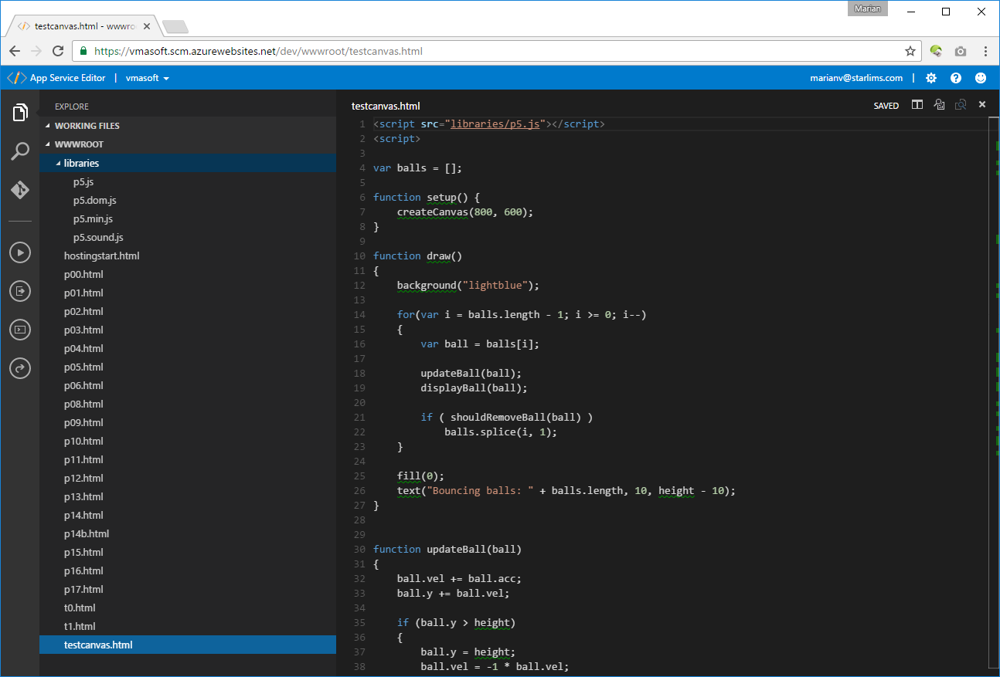
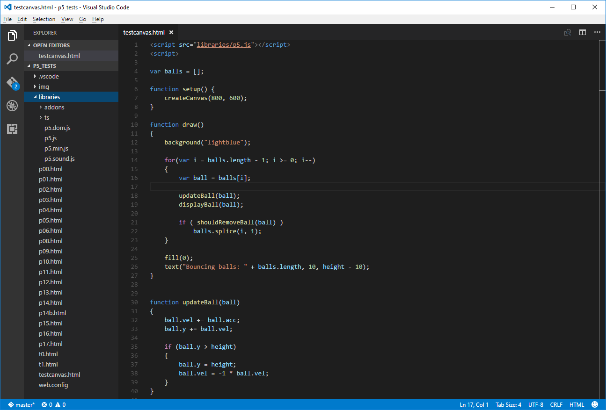

Create Azure web applications using only a browser
==================================================

As a supporter of [STARLIMS Technology Platform](https://www.linkedin.com/in/mveteanu/), you probably understand my enthusiasm of developing and maintaining web applications using only a web browser!

I will not get into the benefits of this type of development but I want to point out that if you are interested into Azure cloud then give their “App Service Editor” a spin. You may like it!

App Service Editor, formerly known as Visual Studio Online (Monaco), is a web-based editor for App Services (web apps, API apps … even Azure Functions). Look for a node named “App Service Editor (Preview)” under the “Development Tools” section of your App Service.

If you used Visual Studio Code in the past, then the App Service Editor will look very familiar. They both share the same look and feel as a result of a shared code base. Their code editor is the open source Monaco project available at https://github.com/Microsoft/monaco-editor

In Visual Studio Code, Microsoft basically just wrapped this Monaco editor using GitHub’s electron technology http://electron.atom.io/ to produce a native cross platform application.

To see how similar the “App Service Editor” is with “Visual Studio Code”, I quickly created a “Web App” app service under Azure, took a scrap folder of HTML files and uploaded them under the new app service. I then loaded the same folder offline in Visual Studio code.

As you can see from the following 2 screen captures, the biggest differentiator is only the browser Url bar! The code editing experience is the same!
 

Image 1: App Service Editor

Image 2: Visual Studio Code

Did I mention that “App Service Editor” can be used also to edit and maintain “Azure functions”? -- Those little building blocks that paves the way to serverless applications.

Give it a try … it may give you new ideas of how to implement your next development workflow!

One final note: the “App Service Editor” is not the only one cloud based IDE. In a future article I may explore the different open-source and commercial offerings for moving your IDE in the cloud.
