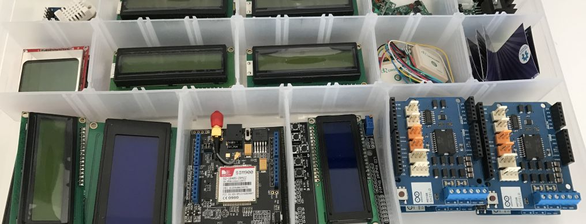
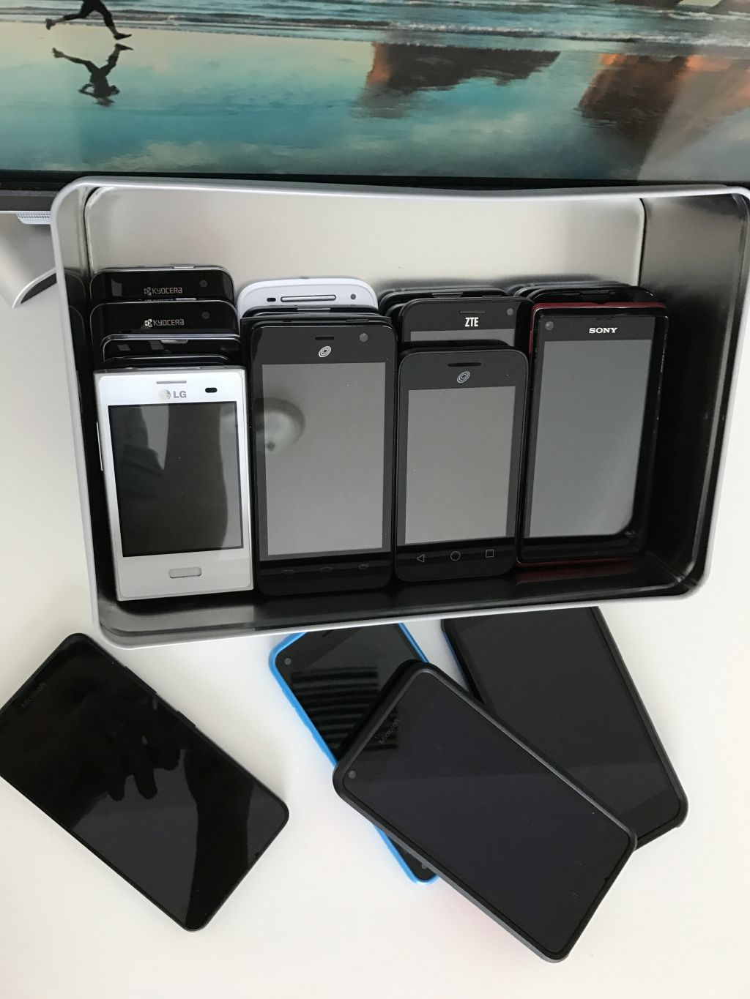
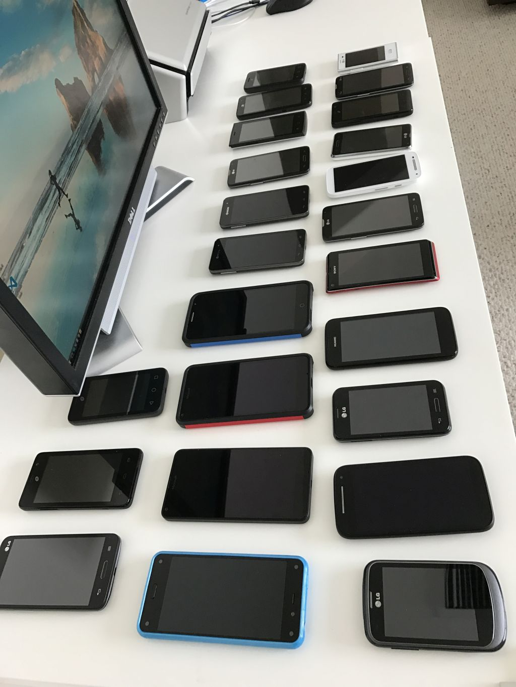
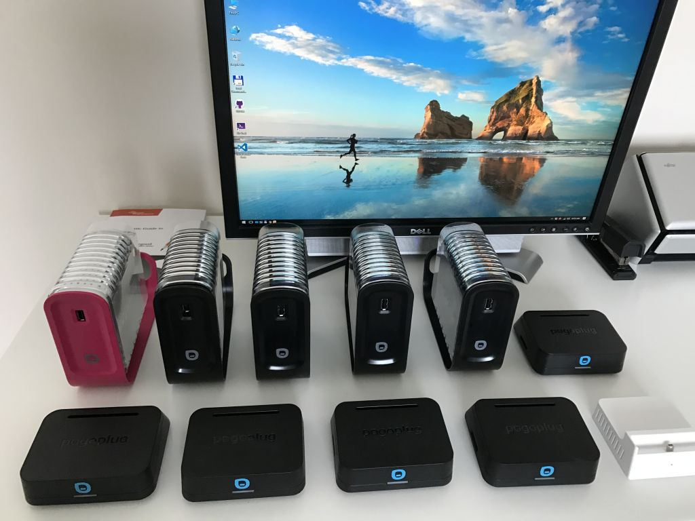
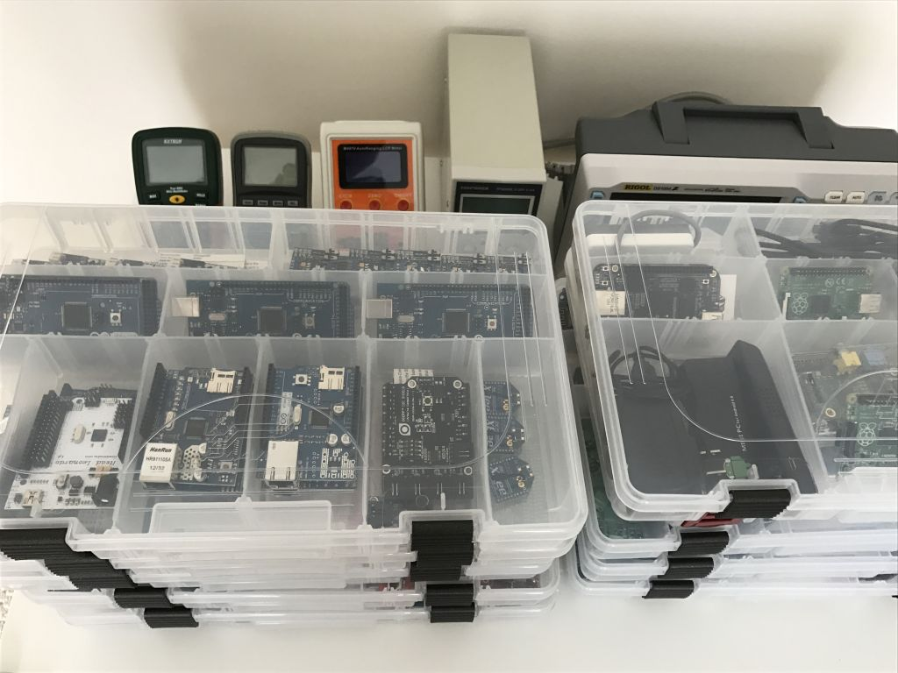
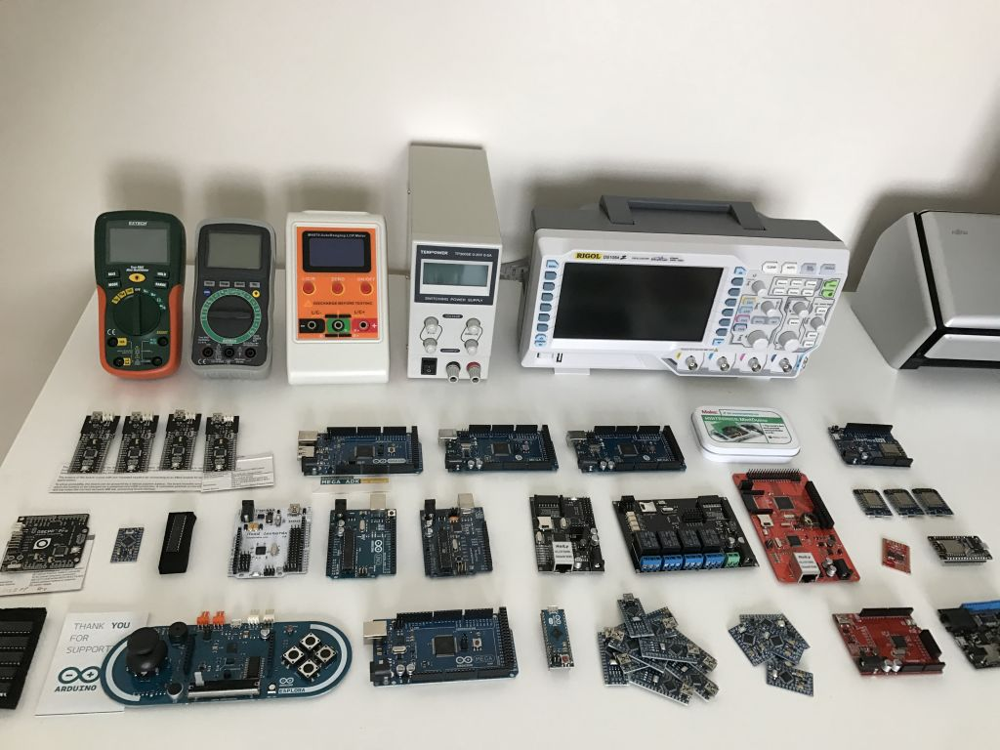
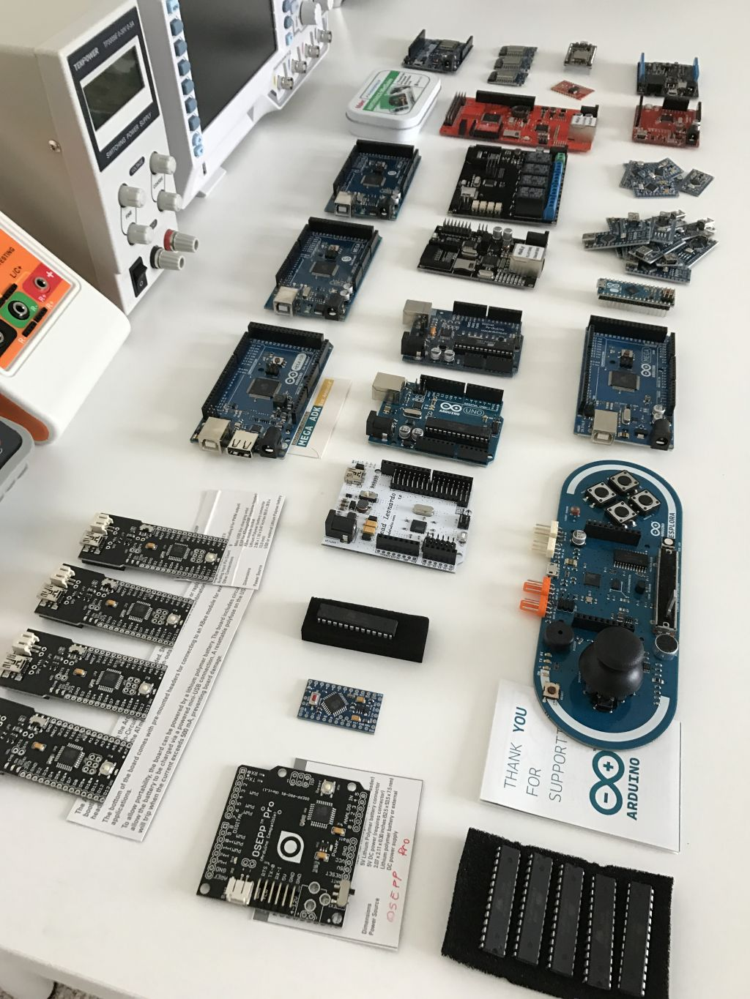

My Collections
==============

Nothing special in this article… just a few pictures with of my electronic components collections. 

As a hobby I play with digital electronics and programmable hardware (from 8 bit micro controllers to Linux bases SBCs).

Therefore I thought to share with you some of my hardware collections… more to come.

Android
-------

For regular day to day work I’m using an iPhone… but for more geeky projects, the iOS cannot beat the Android.

You can easily interface an Android with external hardware (e.g. check below the Arduino ADK) … and you can easily customize many aspects of the OS.
 

 
The android can be used in a variety of hobby projects such as controllers for home automation, UI for embedded systems, etc.

Pogoplug
--------

I actually never really used the pogoplug for its intended use. I tried to do that but I soon found out that is more fun to “hack” these nice inexpensive devices by using a Linux distribution.

With full Linux distributions available for popoplugs (e.g. https://archlinuxarm.org/) these device can become full general purpose mini-servers or can be used in a wide variety of embedded scenarios (e.g. internet radio, IP camera, etc.)

 
Currently I don’t recommend going this route. Instead I recommend going via a more standard route and choosing one of the many types of Linux friendly single board computers with more features, better documentation and more IOs (such a TI Beaglebone, Raspberry PI, or even one of the many cheap Linux SBCs that you can get for a few $).

Arduino
-------

I like Arduino for their effort to create a standard, well documented hardware platform and development environment approachable to everyone.

Before Arduino, working with microcontrollers was a reserved threat to electrical engineers only. The documentation was technical, the cost for evaluation boards was high and the toolsets required to program a microcontroller was way different than regular desktop programming.

Arduino took a humble 8 bit microcontroller from Atmel and created a standard board with clean and easy API / documentation. Then by leveraging some other open source projects they created an IDE that exposes C++ and above mentioned API to beginners that some may have never programmed before.

It is true… others tried to democratize programmable hardware before. Parallax with their BASIC STAMP is such example. However, due to the close nature of their platform they didn’t achieve the success of Arduino.

  
We are living interesting times. If you are a software developer there is now easier than ever to program an embedded device - even if you don't have EE knowledge.
There are tons of success stories. I may cover this later.

